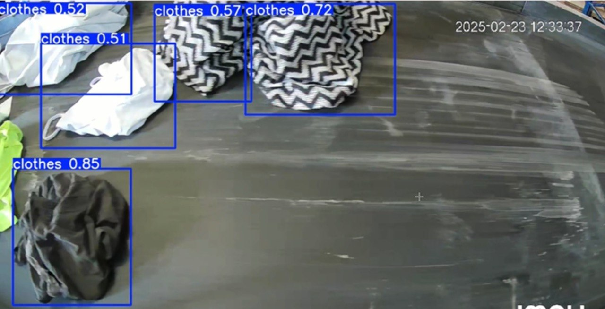
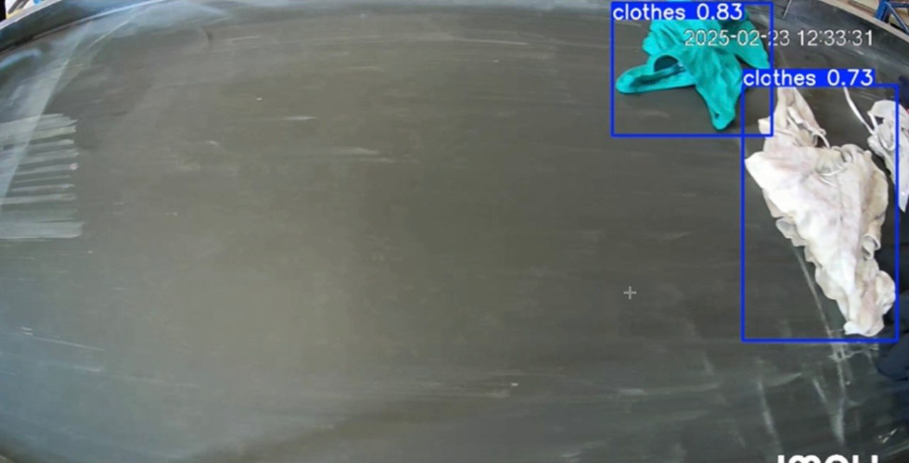
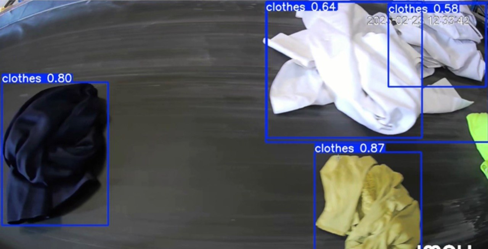
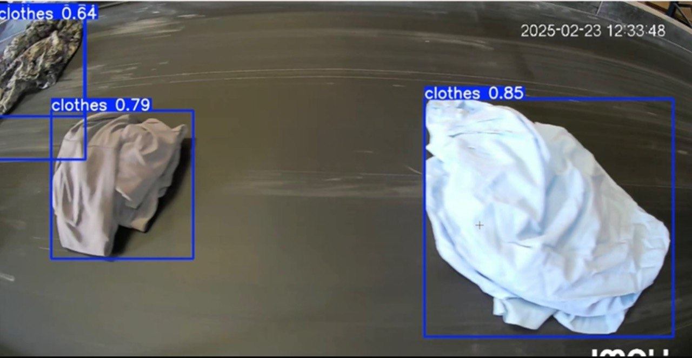
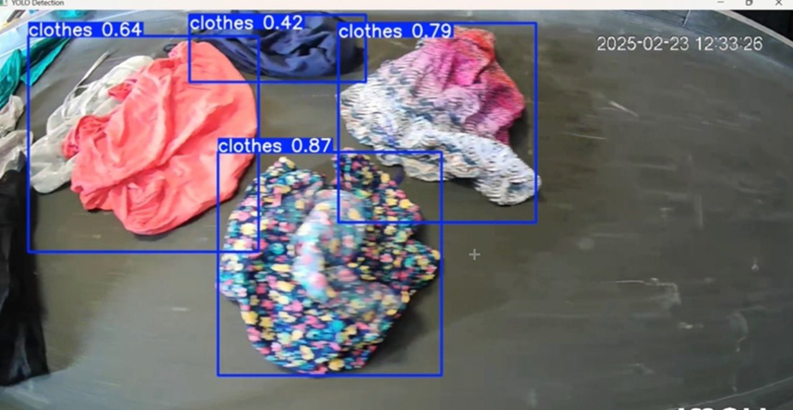
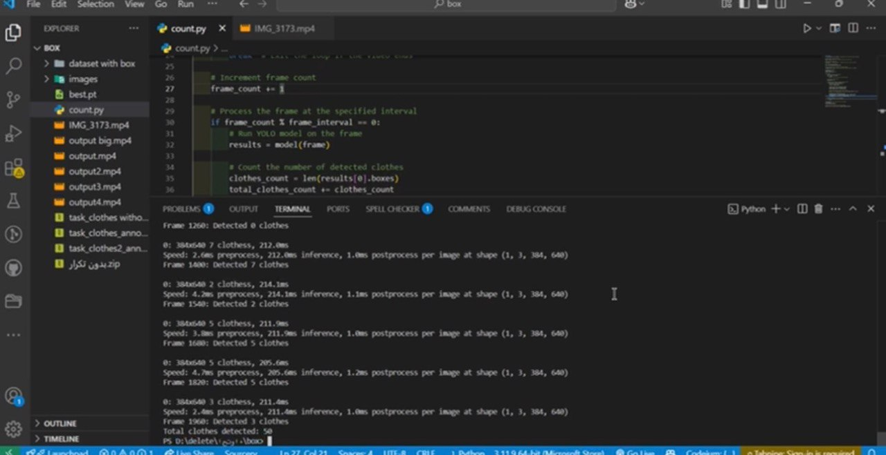

# Clothing Donation Counter

A computer vision system that uses YOLOv8 to detect and count clothing donation items from images and videos, displaying the results in a Streamlit dashboard.
---

## Features

- Object detection with YOLOv8 (custom-trained)
- Real-time count and visualization
- Streamlit dashboard with charts and tables
- Supports image and video input

---

## Tech Stack

- Python
- YOLOv8
- Streamlit
- OpenCV
- Pandas & Matplotlib

---

## Screenshots

Here are sample outputs from the YOLOv8 model detecting clothing items on a conveyor belt:

| Detection 1 | Detection 2 | Detection 3 |
|-------------|-------------|-------------|
|  |  |  |

| Detection 4 | Detection 5 | Detection 6 |
|-------------|-------------|-------------|
|  |  |  |

---

## Future Work

- [ ] Improve detection for overlapping or similar-looking clothes
- [ ] Add item classification (by type or fabric)
- [ ] Support real-time detection via webcam
---

## Author

Nada Alshamrani – [LinkedIn Profile](https://www.linkedin.com/in/nada-alshamrani-732884250)
