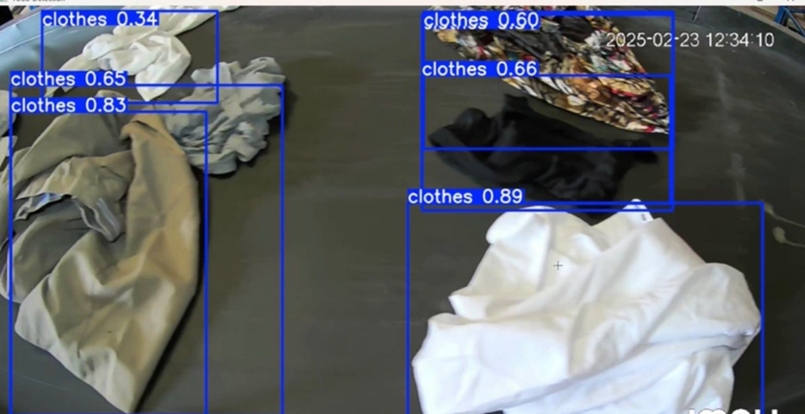

# Clothing Donation Counter

A computer vision system that uses YOLOv8 to detect and count clothing donation items from images and videos, displaying the results in a Streamlit dashboard.
---

## Features

- Object detection with YOLOv8 (custom-trained)
- Real-time count and visualization
- Streamlit dashboard with charts and tables
- Supports image and video input

---

## Tech Stack

- Python
- YOLOv8
- Streamlit
- OpenCV
- Pandas & Matplotlib

---

## Screenshots

### Detection Examples

---

## Future Work

- Improve detection of similar-looking items
- Add classification by type or fabric
- Live webcam or video streaming support

---

## Author

Nada Alshamrani – [LinkedIn Profile](https://www.linkedin.com/in/nada-alshamrani-732884250)
